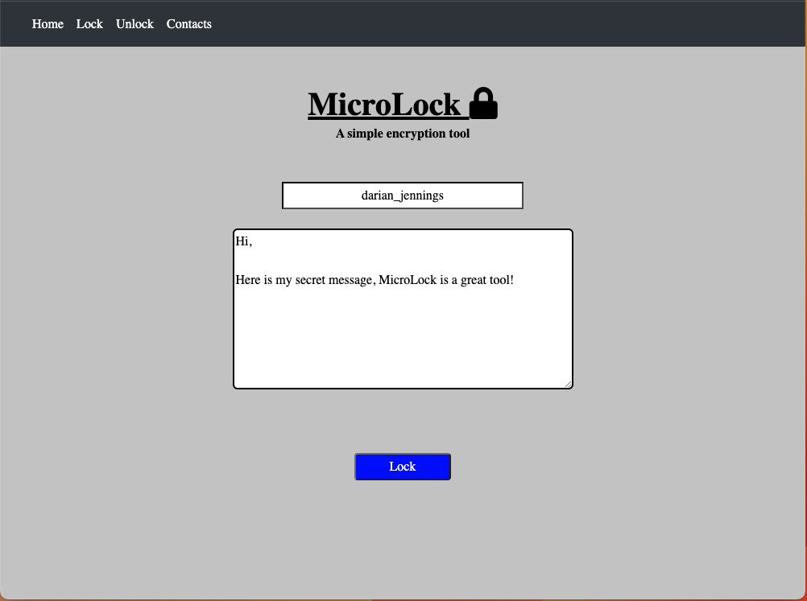

# MicroLock

<a href="https://drive.google.com/file/d/1kmPIBnk7XrRyn9K4SFD7KcSMI3zxCqf_/view?usp=sharing"><strong>Read the Code Report »</a>

We wanted to make encryption accessibile to everyone - beginners, experts, and anyone in between! So we created this easy to use encyption tool.

This tools works by importing and exporting secure and trusted contacts into the system. From there you can select a contact to send a message to, write out the message, and the system will encrypt the message. You can then copy the encrypted text and send it via any platform such as email, text, social media. On the other end, only the user for which you encrypted the message can decrypt the encrypted message. Once the reciepent has the encrypted message they can naviagte to MicroLock -> Unlock and paste in the encrypted message. If this is indeed the correct user it will decrypt the message back to plain text, if it not the intended user then the message will remain encrypted.

